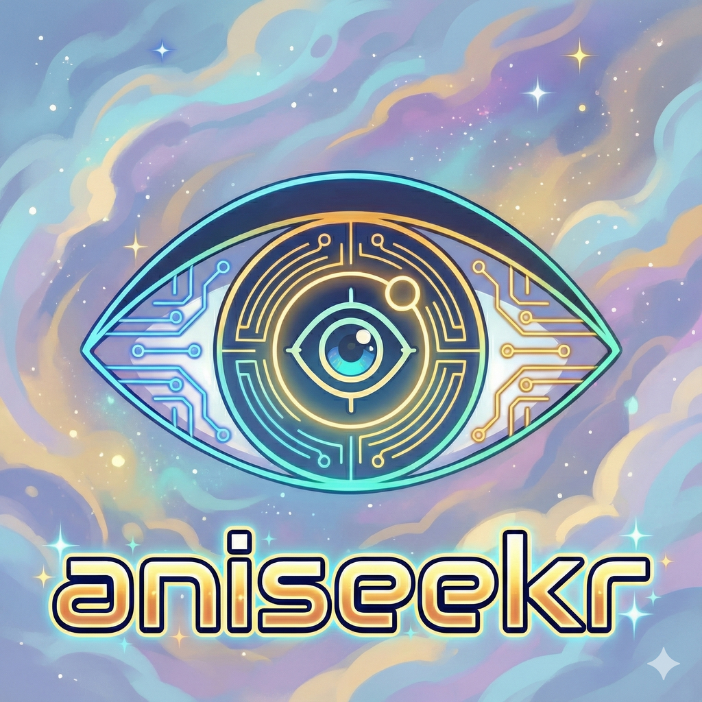

<div align="center">



# Aniseekr

**Anime tracker · multi-source aggregator · 聖地巡礼 (pilgrimage) companion**

[](https://aniseekr.moe/)
[](https://apps.apple.com/us/app/aniseekr-anime-tracker/id6755444960)
[](https://play.google.com/store/apps/details?id=com.kidneyweakx.aniseekr)

<br />

[](./LICENSE)
[](https://expo.dev)
[](https://reactnative.dev)
[](https://www.typescriptlang.org/)
[](#)
[](./CONTRIBUTING.md)

<sub>Aggregates · <a href="https://anilist.co/">AniList</a> · <a href="https://bgm.tv/">Bangumi</a> · <a href="https://myanimelist.net/">MyAnimeList</a> · <a href="https://kitsu.io/">Kitsu</a> · <a href="https://annict.com/">Annict</a> · <a href="https://simkl.com/">Simkl</a> · <a href="https://shikimori.one/">Shikimori</a> · <a href="https://anitabi.cn/">Anitabi</a></sub>

</div>

---

## What it does

Aniseekr is a local-first anime tracker for iOS and Android with a built-in pilgrimage (聖地巡礼) camera that lets you frame real-world locations against the original anime scene.

- **Multi-source aggregation.** Pulls metadata from AniList, Bangumi, MyAnimeList (via Jikan), Kitsu, Annict, Simkl and Shikimori. Switch sources without losing your library.
- **Local-first storage.** Your library, ratings, and visit log live on-device (MMKV + SQLite). Optional encrypted cloud backup to iCloud / Google Drive via [`@noble/ciphers`](https://github.com/paulmillr/noble-ciphers).
- **Pilgrimage map.** Cross-indexed Anitabi + Anime Tourism 88 scene coordinates, with a Vision-Camera compare flow that overlays the original frame on your live viewfinder.
- **Themeable.** 8 built-in palettes, custom accent picker, contrast & tint controls, light/dark/auto modes.
- **Privacy-respecting.** No third-party tracking SDKs on the data path. Crash/diagnostics via opt-in Microsoft Clarity. See [Privacy](#privacy).

## Tech stack

| Layer | Stack |
|-------|-------|
| App   | Expo SDK 54 · React Native 0.81 · Expo Router 6 · TypeScript 5.9 |
| State | MMKV (sync), SQLite, React Query |
| UI    | Themed primitives (`components/themed/`) · Reanimated 4 · Skia · Bottom Sheet · FlashList |
| Camera | react-native-vision-camera 5 · Nitro Modules · Worklets |
| Maps   | Leaflet (web), react-native-maps (native) |
| Crypto | `@noble/ciphers`, `@noble/hashes` (XChaCha20-Poly1305 backup) |
| Monetisation | RevenueCat (in-app purchase), AdMob (free tier) |

## Getting started

> Requires [Bun](https://bun.sh), Xcode 16+ (iOS), Android Studio (Android), and the Expo CLI.

```bash
git clone https://github.com/Aniseekr/aniseekr-expo.git
cd aniseekr-expo
bun install

# iOS simulator
bun run ios

# Android emulator
bun run android

# Type check + tests
bun run typecheck
bun test
```

See [`CLAUDE.md`](./CLAUDE.md) for the in-repo architecture guide (theme system, navigation budgets, state-ownership rules — written for AI assistants but readable by humans).

## Project layout

```
app/                     Expo Router screens (file-based routing)
components/themed/       Theme-aware primitives — default for new UI
components/<feature>/    Feature-scoped components (bangumi, pilgrimage, rate, …)
context/ThemeContext.tsx Single source of truth for theme palette
libs/services/           Data layer (sources, cache, prefs, sync)
libs/services/pilgrimage Pilgrimage / camera / Anitabi pipeline
modules/                 Native bridges (haptics, vibration, CloudKit)
__tests__/unit/          Bun unit tests
```

## Data source attribution

Aniseekr is a **client** for several public anime catalogues. The catalogue content belongs to its providers and is governed by their terms — not by this repository's Apache-2.0 licence.

| Source | What we use | Terms |
|--------|-------------|-------|
| [AniList](https://docs.anilist.co/) | Titles, posters, tags, scoring | [AniList ToS](https://anilist.co/terms) |
| [Bangumi (bgm.tv)](https://bangumi.github.io/api/) | Titles, characters, CN tags | [bgm.tv ToS](https://bgm.tv/about/guideline) |
| [MyAnimeList via Jikan](https://jikan.moe/) | Titles, rankings | [Jikan ToS](https://jikan.moe/) · [MAL ToS](https://myanimelist.net/about/terms_of_use) |
| [Kitsu](https://kitsu.docs.apiary.io/) | Titles, posters | [Kitsu ToS](https://kitsu.io/terms) |
| [Annict](https://developers.annict.com/) | JP airing schedule, titles | [Annict ToS](https://annict.com/terms) |
| [Simkl](https://simkl.docs.apiary.io/) | Cross-platform sync | [Simkl ToS](https://simkl.com/terms/) |
| [Shikimori](https://shikimori.one/api/doc) | RU/JP titles | [Shikimori ToS](https://shikimori.one/pages/terms_of_service) |
| [**Anitabi**](https://anitabi.cn/) | **Pilgrimage scene coordinates & screenshots** | **[CC BY-NC-SA 4.0](https://creativecommons.org/licenses/by-nc-sa/4.0/)** — non-commercial; we display attribution in-app on every Anitabi-rendered surface. |
| [Anime Tourism 88](https://animetourism88.com/) | JP pilgrimage spot index | Public dataset |

If you **fork** Aniseekr and run it under a different brand, you are responsible for honouring each upstream provider's terms — including registering your own API keys where required and complying with Anitabi's non-commercial clause.

## Privacy

- **No tracking, no ad-ID linkage.** Apple Privacy Manifest (`app.json` → `NSPrivacyTracking: false`) and the corresponding Play Data Safety declaration ship as part of every release.
- **On-device data.** Library, ratings, and visit log are stored locally (MMKV + SQLite). Backups are end-to-end encrypted with XChaCha20-Poly1305 before being uploaded to your own iCloud Drive or Google Drive container.
- **Diagnostics.** Crash and anonymous interaction telemetry is collected via Microsoft Clarity and Google AdMob (free tier only — premium users opt out via [RevenueCat](https://www.revenuecat.com)). Both are gated behind feature flags and can be disabled at build time.
- **Permissions** ([`app.json`](./app.json)): location is used only for the nearby-spots query; photos / media library is used only when you save a comparison shot; motion sensor is used only by the compass overlay in the compare flow.

Full privacy policy: [aniseekr.moe/privacy](https://aniseekr.moe/privacy)

## Trademark

The Aniseekr name and logo are trademarks of the Aniseekr project. The Apache-2.0 licence covers the source code but **not** the brand — see Section 6 of the [LICENSE](./LICENSE). If you fork Aniseekr for redistribution, please rename your build.

## Contributing

PRs, bug reports, and translations are welcome. See [CONTRIBUTING.md](./CONTRIBUTING.md) for the workflow, code style, and the architectural rules every change has to satisfy (themed primitives only, no hardcoded hex, no fake placeholder data, etc.).

## Security

Found a security issue? Please **do not** open a public GitHub issue. Email [gm@aniseekr.moe](mailto:gm@aniseekr.moe) with details and we will respond within 72 hours.

## License

Copyright 2026 Aniseekr.

Licensed under the [Apache License, Version 2.0](./LICENSE). See [NOTICE](./NOTICE) for third-party attribution.

---

<div align="center">
<sub>Made with ❤️ for the 聖地巡礼 community.</sub>
</div>
